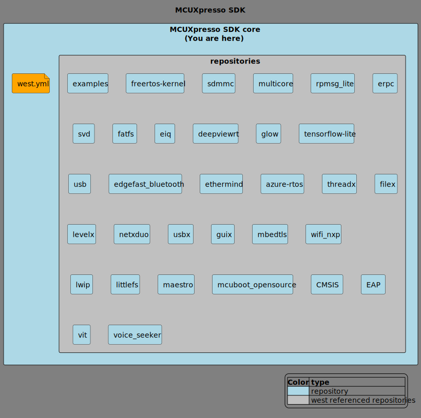

# MCUXpresso SDK：mcux-sdk

[中文](./README_CN.md)|[EN](./README.md)
[](https://github.com/NXPmicro/mcux-sdk/releases/latest)
[](https://github.com/NXPmicro/mcux-sdk/graphs/contributors)
[](https://github.com/NXPmicro/mcux-sdk/issues)
[](https://github.com/NXPmicro/mcux-sdk/pulls)

MCUXpresso SDK 是一个综合性软件支持包，帮助您使用恩智浦基于Arm® Cortex®-M内核的MCU(包括其通用、跨界和Bluetooth™ MCU)简化和加快应用开发。该项目为用户提供了除 SDK builder 和 MCUXpresso IDE 之外的另一种方式来获取 MCUXpresso SDK 的源代码。

我们将MCUXpresso SDK软件支持包的内容拆分成多个子项目并发布到单独的代码仓库。子项目分类如下：
* 提供处理器头文件，启动代码，板级配置模板和外设驱动代码的基础代码库，即当前项目。
* 基于基础代码库，提供嵌入式实时操作系统源代码的项目。
* 基于基础代码库的上层组件，又称为中间件项目。
* 基于上述项目的板级应用代码库。

拆分成多个子项目发布的想法主要是受到 [Zephyr](https://github.com/zephyrproject-rtos/zephyr) 的启发，用户可以从这种发布方式中得到以下好处：

1. 避免单个代码仓库过大。当前项目包含了MCUXpresso SDK 2.9.0版本以上所有的MCU的软件支持，如果所有内容放在一个代码仓库里面，会造成这个代码仓库过于臃肿，后续git的管理效率也会受到影响。
2. 用户可以灵活地根据应用的需要选择子项目。举个例子，如果用户的应用只需要SDK的驱动以及FreeRTOS，其他的内容不需要，那么用户可以只拉取基础代码库和FreeRTOS子项目的代码，不用拉取其他子项目的代码。
3. 用户可以根据需要获取不同子项目的代码版本。因为不同的项目放在自己的代码仓库里面，所以代码版本可以分开管理。如果用户只希望升级SDK驱动的代码，那么用户只需要升级基础代码库的版本就可以了。

为了方便管理不同子项目的版本，我们利用 [Zephyr west 工具](https://docs.zephyrproject.org/latest/guides/west/index.html) 对多个代码仓库进行管理。使用west工具，用户也可以方便地创建自己的 ```west. yml``` 选择需要的子项目供应用使用。

## 概述
当前项目为所有恩智浦常用部件提供了基础支持：

* Arm® CMSIS-CORE 启动和处理器头文件以及 CMSIS-DSP 标准库
* 开源外设驱动程序，提供无状态、高性能、易于使用的 API
* 通信外设的驱动程序还包括用于高性能数据传输的高级交易API，以及借助实时操作系统服务满足实时操作系统用例的实时操作系统包
* 高质量软件：所有驱动程序和启动代码均符合 MISRA-C: 2012 标准并使用 Coverity® 静态分析工具进行了检验

**当前项目可以单独运行**，如果你只想获得对处理器或开发板的基础支持，你只需使用原始的Git方式克隆和检出项目即可。

**当前项目也是获取SDK所有项目的中央存储库**，它包含的[west.yml](https://github.com/NXPmicro/mcux-sdk/blob/main/west.yml)记录了所有可用的SDK子项目以及使用的版本。当前可以拿到的子项目如下图所示，用户可以单击任意的子项目来导航到该项目的代码仓库。
[](https://htmlpreview.github.io/?https://github.com/DavidJurajdaNXP/mcux-sdk/blob/update_repository_map/docs/sdk_graph.svg)
获取所有的SDK项目，你需要同时安装 Git 和 West，可以参考下面的命令来获取一份新的SDK所有项目或者更新已有的SDK项目：
* 获取一份新的SDK所有项目

    请执行下面的命令来获取SDK所有项目在软件版本 ```${revision}``` 的发布，并将其放在名为 ```mcuxsdk``` 的文件夹中。

    ```
    west init -m https://github.com/NXPmicro/mcux-sdk --mr ${revision} mcuxsdk
    cd mcuxsdk
    west update
    ```

    将 ```${revision}``` 替换为您希望获取的SDK软件版本(分支名/标签名/提交的SHA号)。如果您想要拿到最新状态的SDK，使用 ```main```。

* 更新已有的SDK所有项目

    假定你曾经执行上面的命令获取了一份新的SDK所有项目并放在west工作区mcuxsdk目录下, 这时中央存储库是被放到mcuxsdk/core目录。如果想要更新本地的SDK所有项目到另外一个指定的版本，需要先更新中央存储库到指定版本，然后对整个west工作区做更新:

    想要拿到中央存储库所在分支上SDK所有项目的最新更新，参考命令如下：
     ```
    cd mcuxsdk/core
    git fetch
    git rebase
    west update
    ```
    想要获取与中央存储库当前所在版本不同的更新，比如说不同的分支，不同的发布标签或者不同的提交序列号，参考命令如下：
    ```
    cd mcuxsdk/core
    git fetch
    git checkout ${revision}
    west update
    ```
    将 ```${revision}``` 替换为您希望更新的SDK软件版本。

## 软件发布
当前项目设计了两种类型的发布。 MCUXpresso SDK 版本和 GitHub Main SDK 版本。下面的描述使用 **MCUX 发布** 是 MCUXpresso SDK 版本的缩写，使用 **Main 发布** 是 GitHub Main SDK 版本的缩写。

### MCUX 发布
MCUX 发布用来同步最新的SDK支持，一旦新版本的SDK在 [SDK Builder](http://mcuxpresso.nxp.com/) 上发布，我们就开始同步准备该版本MCUX 的发布。使用过[SDK Builder](http://mcuxpresso.nxp.com/) 的用户可以很容易地在当前项目中找到与与获取的 SDK 2.x.y 软件支持包代码一致的软件版本MCUX_2.x.y, 该软件版本发布的代码通过了编译和运行测试，有很好的质量保证。**MCUX 发布的版本将带有前缀“MCUX_”**，并且每个版本都将合并到main分支中以确保main分支包含所有已发布的处理器和开发板支持。

“MCUX_” 发布的版本包含主要版本和 NPI（新处理器）版本。
* 对于主要版本，对应NXP一年两次主要的软件发布。该发布对 NXP 热门的处理器进行全局功能更新。主要版本一般是2.x.0, 版本号x依次增加。
* 对于 NPI（新处理器）版本，它对应NXP在市场上新推的处理器相应的软件发布。它一般是基于最近一次主要版本的软件构建的。版本名称后缀为 NPI 名称以标识它是 NPI 版本。

每次新发布的 MCUX 版本都是基于最近一次的主要版本/NPI 版本上branch out出来准备的，因此用户可以使用````git diff`` 命令轻松检查两个版本之间的差异。

### Main 发布
Main 发布是在代码仓库main分支上发布的常规版本。该发布总是基于main分支上最新的软件代码，包括所有在此次Main发布以前的“MCUX_”发布内容以及恩智浦新处理器在main分支上的支持。**主要版本将以“MAIN_”为前缀**。

下图以 2.9.0 和 2.10.0 版本为例，展示了 MCUX 版本和 Main 版本之间的关系。


## 支持的开发工具和硬件
* 工具
    * MCUXpresso IDE
    * GCC ARM Embedded

    对于所用工具的版本，如果是工作在main分支上，请查看最新一次软件发布的 [Release Notes](https://github.com/NXPmicro/mcux-sdk/releases/latest)。工作在特定版本上，查看[对应版本](https://github.com/NXPmicro/mcux-sdk/tags)的Release Notes。
* 硬件支持

    请参阅 [支持的硬件](docs/supported_development_systems_CN.md) 以获取该项目当前支持的开发板/处理器列表。

## 入门
请参考 [快速开始](docs/Getting_Started_CN.md)

## 许可
当前项目中的所有 SDK 驱动程序、组件、处理器支持文件、板级模板文件均在 BSD-3-Clause 许可下，许可请查看 [COPYING_BSD-3](COPYING-BSD-3)。 ARM CMSIS 组件在 Apache 许可证 2.0 下，许可检查 [Apache 许可证 2.0](CMSIS/LICENSE.txt)。SDK所有项目的许可信息可以在 [SW-Content-Register.txt](SW-Content-Register.txt) 中找到。

## 贡献代码
非常欢迎各位开发者贡献代码！有关贡献代码的详细指南，请参考 [贡献代码](CONTRIBUTING_CN.md)。
